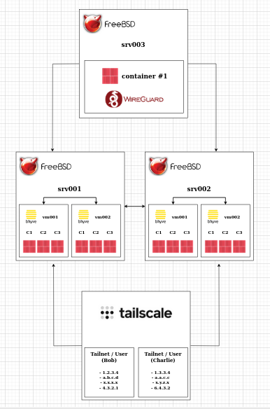

# cloud-machine

**cloud-machine** is a set of scripts that uses [beanstalkd](https://beanstalkd.github.io/) and [vm-bhyve](https://github.com/churchers/vm-bhyve) to create virtual machines with FreeBSD as guest OS (with the latest patches installed) in a distributed fashion. Some customizable scripts also install [Tailscale](https://tailscale.com/), [AppJail](https://appjail.readthedocs.io/), [DNSMasq](https://thekelleys.org.uk/dnsmasq/doc.html), [Director](https://github.com/DtxdF/director), [WireGuard](https://www.wireguard.com/) and more, all ready to use.

## Architecture

<p align="center">
    
</p>

The manager (user who administers the cluster) on one of the cluster hosts (in this case `srv001` and `srv002`) sends, using beanstalkd, a job to create a new VM with all the parameters specified by the manager. The manager can be on the host to which the job is sent, so it can be source and destination at the same time. Although the manager can submit a job to another host in the cluster, if it continues to submit jobs to the same host where it is located and reaches the defined limits, the job is redirected to the next host and the same decisions are made if the limits are reached. The final destination of these "hops" is when the "next host" is `null`, so there is no possibility of creating a new VM. This scales very well without adding more layers of complexity.

After a host picks up a job, it will create the VM. The instructions for creating a VM are in the [create.sh](docs/create.sh.md) script, which is the same for each new VM to be created, but what may be different (and what gives you the power) are [pre.sh](docs/create.sh.md), [local.sh](docs/create.sh.md) and [post.sh](docs/create.sh.md), the customizable scripts that run only if they exist.

If you want to learn more about the responsibility of these scripts, read the [Files](#files) section. But I will explain at least some relevant responsibilities that create the architecture you see above.

The customizable scripts configure more things than [create.sh](docs/create.sh.md) as I said, but the important thing is that they configure Tailscale and WireGuard. Tailscale is used to communicate with the user globally in a secure way. Tailscale allows you to use your exposed services from your VM to any device on your Tailnet. WireGuard is used as a way to communicate between the same VMs on the same VPN. The performance with WireGuard is of course better, but more importantly it can allow two or more VMs to communicate with each other even if they are not owned by the same user.

Once the virtual machine is up and running, it has AppJail installed (and configured), Director, DNSMasq installed (and configured), WireGuard installed (and configured), Tailscale installed (and configured) and a few more tools, such as cpdup, which is used by LittleJet.

## Goals

This is an internal project to deploy virtual machines using vm-bhyve around all my machines even if they are not physically in the same location. I have found that I can designate certain responsibilities or tasks to specific virtual machines to get a better organization of all my systems. This is of course motivated to use my other project, AppJail, and all the other meta-projects ([Director](https://github.com/DtxdF/director)], [LittleJet](https://github.com/DtxdF/LittleJet), [Reproduce](https://github.com/DtxdF/reproduce), etc.).

I have no intention of running a Linux distro or even Windows, or even another *BSD system other than FreeBSD. This is intentional because I use FreeBSD whenever I can. However, note that the scripts are really customizable or easy to change, so if you are an adventurous user, you can fork this project and modify it to suit your needs. 

## Requirements

### Software

* [lang/python](https://freshports.org/lang/python)
* [textproc/ripgrep](https://freshports.org/textproc/ripgrep)
* [sysutils/vm-bhyve-devel](https://freshports.org/sysutils/vm-bhyve-devel)
* [dns/dnsmasq](https://freshports.org/dns/dnsmasq)
* [net/dhcpd](https://freshports.org/net/dhcpd)
* [sysutils/py-supervisor](https://freshports.org/sysutils/py-supervisor)
* [devel/py-virtualenv](https://freshports.org/devel/py-virtualenv)
* [devel/py-pip](https://freshports.org/devel/py-pip)
* [devel/git](https://freshports.org/devel/git)
* [textproc/jq](https://freshports.org/devel/jq)

### Hardware

This really depends on your needs because the minimum template uses 256 MiB of memory and 20 GiB of storage but this can be changed of course, and probably these resources will not fit to run the application you want, so I assume you know what you really require.

Another requirement is the server or PC to run the WireGuard server using [wireguard-xcaler](https://github.com/DtxdF/wireguard-xcaler).

I recommend you to use an SSD (or something better) instead of an HDD to get the best performance when creating a virtual machine. You can use a HDD, the problem is when you disable write caching. Enabling write caching increases performance, of course, but at the cost of data integrity.

## Installation

I assume you have installed and configured vm-bhyve correctly, but if not, read the vm-bhyve [README](https://github.com/churchers/vm-bhyve?tab=readme-ov-file#quick-start) and [wiki](https://github.com/churchers/vm-bhyve/wiki).

```sh
mkdir -p /cloud-machine
git clone https://github.com/DtxdF/cloud-machine.git /cloud-machine/scripts
cd /cloud-machine/scripts
virtualenv env
cp templates/*.conf /cloud-machine/vm/.templates
. env/bin/activate
pip install -r requirements.txt
mkdir -p components
fetch -o components/MANIFEST 'https://download.freebsd.org/releases/amd64/14.1-RELEASE/MANIFEST'
fetch -o components/base.txz 'https://download.freebsd.org/releases/amd64/14.1-RELEASE/base.txz'
fetch -o components/kernel.txz 'https://download.freebsd.org/releases/amd64/14.1-RELEASE/kernel.txz'
mkdir -p cluster/logs
echo "tmpfs /cloud-machine/scripts/cluster/logs tmpfs rw,late 0 0" | tee -a /etc/fstab
mount /cloud-machine/scripts/cluster/logs
```

**Note**: You can use a different version other than `14.1-RELEASE`.

### Configuration

**WARNING**: Don't blindly copy files, open your favorite editor and move things around a little at a time.

```sh
cp host/dhcpd.conf /usr/local/etc/dhcpd.conf
cp host/loader.conf /boot/loader.conf
cp host/pf.conf /etc/pf.conf
cp host/rc.conf /etc/rc.conf
cp host/supervisord.conf /usr/local/etc/supervisord.conf
mkdir -p /usr/local/etc/supervisord.d
cp host/supervisord.d/cloud-machine.ini /usr/local/etc/supervisord.d
```

**Note**: Note that these files are tailored to my system and are not portable. For example, my network card using the `if_em(4)` driver may not make sense in your system.

## Files

* **cluster/**
  - [cluster.py](docs/cluster_cluster.py.md)
  - [settings.json](docs/cluster_settings.json.md)
* [config.conf](docs/config.conf.md)
* [create-switch.sh](docs/create-switch.sh.md)
* [create.sh](docs/create.sh.md)
* [deploy.sh](docs/deploy.sh.md)
* [destroy.sh](docs/destroy.sh.md)
* [diff-metrics.py](docs/diff-metrics.py.md)
* **files/**
  - **boot/**
    - [loader.conf](docs/files_boot_loader.conf.md)
  - **etc/**
    - [pf.conf](docs/files_etc_pf.conf.md)
    - [rc.conf](docs/files_etc_rc.conf.md)
    - [resolv.conf](docs/files_etc_resolv.conf.md)
    - **ssh/**
      - [sshd_config](docs/files_etc_ssh_sshd_config.md)
    - [sysctl.conf](docs/files_etc_sysctl.conf.md)
  - **usr/**
    - **local/**
      - **etc/**
        - **appjail/**
          - [appjail.conf](docs/files_usr_local_etc_appjail_appjail.conf.md)
          - [resolv.conf](docs/files_usr_local_etc_appjail_resolv.conf.md)
        - [dnsmasq.conf](docs/files_usr_local_etc_dnsmasq.conf.md)
        - **pkg/**
          - **repos/**
            - [Latest.conf](docs/files_usr_local_etc_pkg_repos_Latest.conf.md)
* [find.sh](docs/find.sh.md)
* [get-limits.py](docs/get-limits.py.md)
* [get-metrics.py](docs/get-metrics.py.md)
* [get-total-limits.py](docs/get-total-limits.py.md)
* [get-total-metrics.py](docs/get-total-metrics.py.md)
* host/
  - [dhcpd.conf](docs/host_dhcpd.conf.md)
  - [loader.conf](docs/host_loader.conf.md)
  - [pf.conf](docs/host_pf.conf.md)
  - [rc.conf](docs/host_rc.conf.md)
  - [supervisord.conf](docs/host_supervisord.conf.md)
  - **supervisord.d/**
    - [cloud-machine.ini](docs/host_supervisord.d_cloud-machine.ini.md)
* [lib.subr](docs/lib.subr.md)
* [local.sh](docs/create.sh.md)
* [pkg.lst](docs/pkg.lst.md)
* [post.sh](docs/create.sh.md)
* [pre.sh](docs/create.sh.md)
* **profiles/**
  - [CS0.sh](docs/profiles_and_templates.md)
  - [CS1.sh](docs/profiles_and_templates.md)
  - [CS2.sh](docs/profiles_and_templates.md)
  - [CS3.sh](docs/profiles_and_templates.md)
  - [CS4.sh](docs/profiles_and_templates.md)
  - [CS5.sh](docs/profiles_and_templates.md)
* [run.sh](docs/run.sh.md)
* [safe-deploy.sh](docs/safe-deploy.sh.md)
* [safe-exc.sh](docs/safe-exc.sh.md)
* **templates/**
  - [CS0.conf](docs/profiles_and_templates.md)
  - [CS1.conf](docs/profiles_and_templates.md)
  - [CS2.conf](docs/profiles_and_templates.md)
  - [CS3.conf](docs/profiles_and_templates.md)
  - [CS4.conf](docs/profiles_and_templates.md)
  - [CS5.conf](docs/profiles_and_templates.md)
* [timeout.sh](docs/timeout.sh.md)
